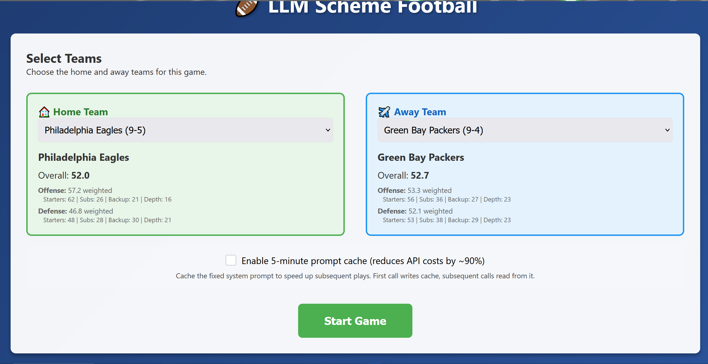
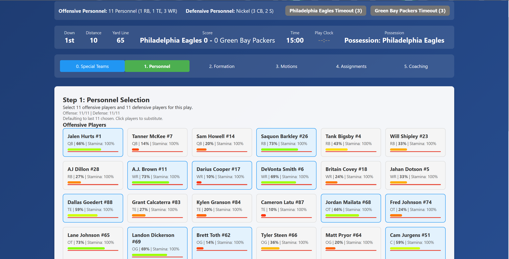
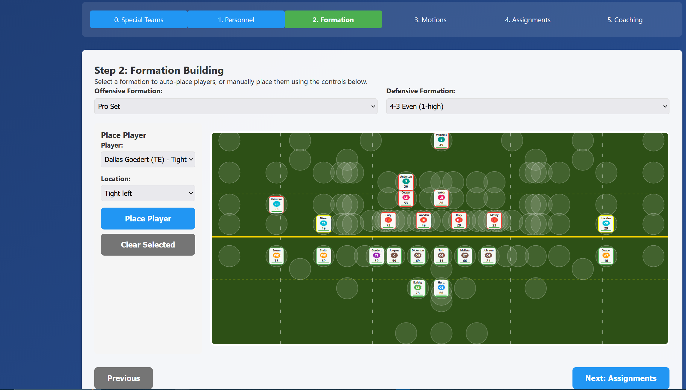
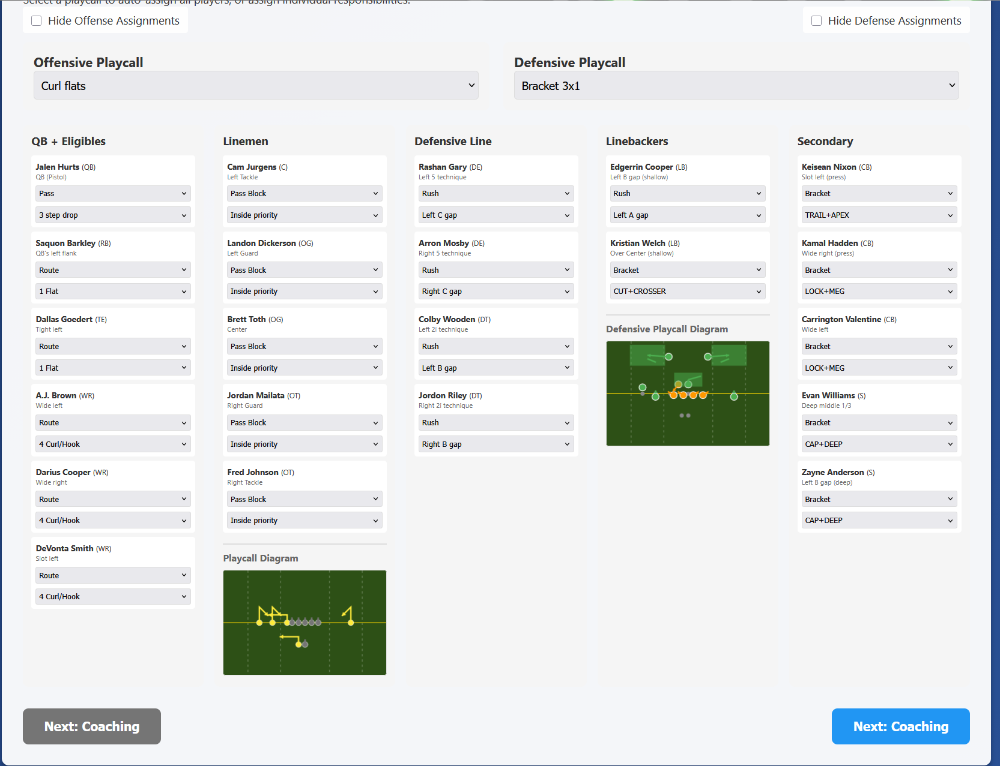
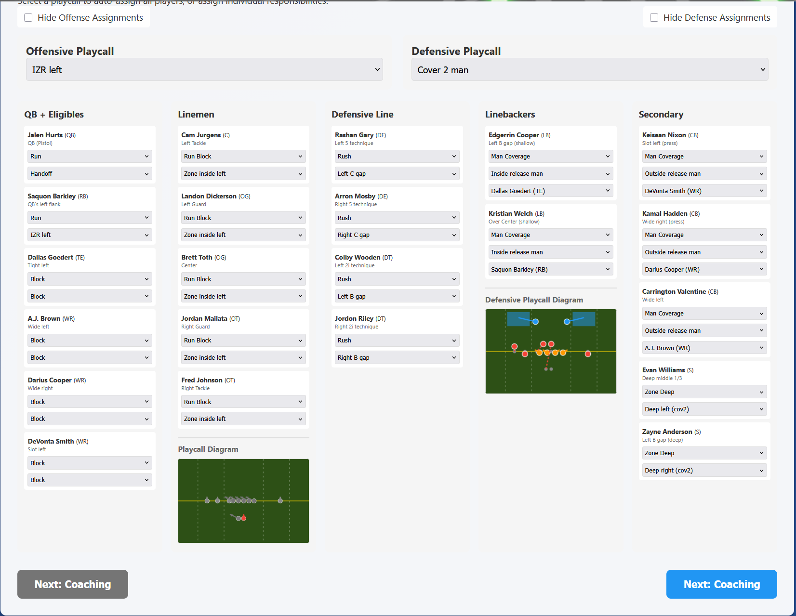
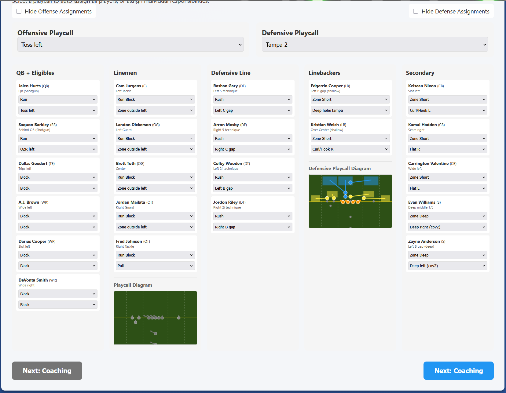
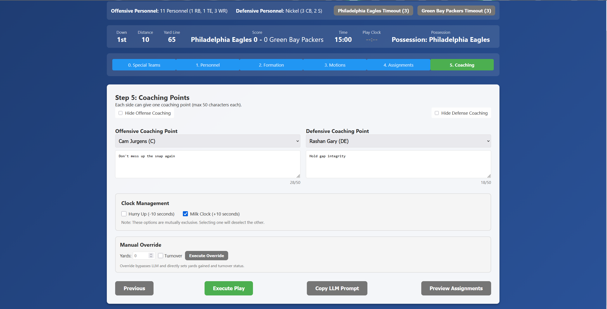
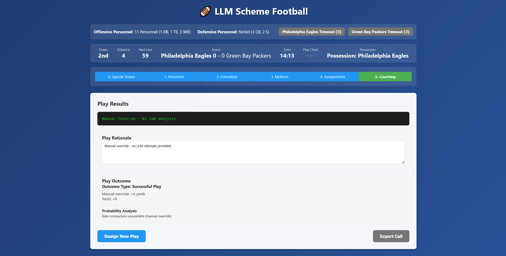

# Football Vibes - NFL RPG Play Designer

An interactive NFL play design and simulation game where you (and an optional split-screen 1v1 opponent) act as an offensive or defensive coordinator, designing plays and evaluating schematic matchups using AI-powered analysis.

## MVP Features

### 5-Step Play Design Workflow

1. **Step 0: Decision** - Choose to run a normal play, punt, or field goal
2. **Step 1: Personnel Selection** - Select 11 offensive and 11 defensive players from game-day rosters
   - Default: 11 personnel (1 QB, 1 RB, 1 TE, 3 WR, 5 OL) for offense
   - Default: Nickel defense (2 DE, 2 DT, 2 LB, 3 CB, 2 S) for defense
3. **Step 2: Formation Building** - Drag and drop players to positions on the field
   - Pre-populated offensive line (T/G/C/G/T)
   - Pre-loaded offensive and defensive formations available via dropdown
   - Visual field with player markers showing name, position, rating, and stamina
4. **Step 3: Motions and Shifts** - (Skipped in MVP)
5. **Step 4: Assignments** - Assign blocking/coverage responsibilities to all players
   - Offensive: Routes, blocks, runs, QB actions
   - Defensive: Coverage zones, man coverage, blitzes, rushes
   - Playcall dropdowns to quickly set default assignments for entire team
   - Visual playcall diagrams showing routes and coverage
6. **Step 5: Coaching Points** - Add one coaching point per side (max 50 characters)

### Game Features

- **AI-Powered Analysis**: LLM evaluates play schematic matchups using spatial+scheme analysis (70% weight), positional matchups (20%), and personnel (10%)
- **State Machine Evaluation**: Determines play outcomes (havoc/explosive/success/unsuccessful) using statistical methods
- **Fatigue System**: Logarithmic fatigue calculation affecting player effectiveness
- **Game State Management**: Tracks down, distance, yardline, score, time, timeouts, and possession
- **Clock Management**: Automatic time runoff based on play type and score differential
- **Special Teams**: Punt and field goal execution with simplified outcomes
- **Possession System**: Tracks which team has the ball and uses appropriate rosters

## Game Flow

Football Vibes is a **split-screen multiplayer game** designed for two players on a single device. One player acts as the offensive coordinator, the other as the defensive coordinator. Players can use checkboxes to hide their assignments and coaching points from their opponent, while personnel and formation information is visible to both sides for realistic playcalling.

### Initial Setup

When you first load the game, you'll select teams for both the home and away sides. Each team has separate offensive and defensive rosters with 24 players each.



### Play Design Phases

Each play follows a structured 5-step workflow (plus an optional special teams decision on 4th down):

#### Phase 0: Special Teams Decision (4th Down Only)

On 4th down, the offensive coordinator must decide whether to:
- **Run a normal play** (go for it)
- **Punt** the ball
- **Kick a field goal**

This decision is only presented on 4th down. On other downs, the game proceeds directly to Phase 1.

#### Phase 1: Personnel Selection

Both coordinators select 11 players from their game-day rosters. The interface shows available players with their ratings, stamina, and injuries. Default personnel packages are available:
- **Offense**: 11 personnel (1 QB, 1 RB, 1 TE, 3 WR, 5 OL)
- **Defense**: Nickel defense (2 DE, 2 DT, 2 LB, 3 CB, 2 S)



Players have percentile ratings (15th-92nd percentile range) that affect their performance. Stamina is displayed and affects player effectiveness based on the logarithmic fatigue system.

#### Phase 2: Formation Building

Players are positioned on the field using drag-and-drop. The offensive line (T/G/C/G/T) is pre-populated, and both coordinators can use formation dropdowns to quickly load standard formations. The visual field shows player markers with name, position, rating, and stamina.



Formations are visible to both players, allowing the defense to respond to offensive alignment for realistic playcalling.

#### Phase 3: Motions and Shifts

This phase is skipped in the MVP version.

#### Phase 4: Assignments

This is where the strategic battle happens. Both coordinators assign responsibilities to their players:

**Offensive Assignments:**
- Routes (dig, go, seam, out, shallow crosser, etc.)
- Blocking schemes (5-man protection, zone blocking, gap schemes)
- Running back aimpoints and protections
- QB actions (eyes direction, protection reads)

**Defensive Assignments:**
- Coverage zones (deep thirds, intermediate zones, underneath coverage)
- Man coverage assignments
- Blitzes and rushes
- Gap responsibilities

Players can use playcall dropdowns to quickly set default assignments for the entire team, or assign individual responsibilities. Visual playcall diagrams show routes and coverage patterns (WIP)





**Privacy Feature**: Each coordinator can check a box to hide their assignments from their opponent, adding strategic depth to the game. Personnel and formation information remains visible to both sides.

#### Phase 5: Coaching Points

Each coordinator can add one coaching point (max 50 characters) to emphasize a specific instruction to a player. This affects the LLM's evaluation of the play.



**Privacy Feature**: Each coordinator can check a box to hide their coaching point from their opponent.

### Play Execution and Evaluation

Once both coordinators complete all phases, the play is executed:

1. **LLM Analysis**: The game builds a detailed prompt (see `context/prompt-pass-schematic-success` for format) that includes:
   - All player positions (X/Y coordinates)
   - Player ratings, stamina, and injuries
   - All assignments (routes, blocks, coverage, blitzes)
   - Coaching points
   - Game situation (down, distance, score, time)

2. **LLM Evaluation**: The LLM (Claude or OpenAI) analyzes the schematic matchup and returns rates in the format specified by `context/eval-format.json`:
   ```json
   {
       "success-rate": 40.0,
       "havoc-rate": 12.0,
       "explosive-rate": 12.0
   }
   ```

   The LLM evaluates:
   - **Spatial relationships** (70% weight): Blocking schemes vs defensive alignments, route combinations vs coverage zones, gaps and leverage
   - **Positional matchups** (20% weight): Player ratings adjusted for stamina and injuries
   - **Personnel quality** (10% weight): Overall team strength

3. **State Machine Processing**: The game uses `play-state-machine.json` to determine the outcome:
   - Roll 1-100 to determine outcome type (havoc/explosive/success/unsuccessful) based on LLM rates
   - For passes: Roll for completion percentage first
   - Roll for specific havoc outcomes (sack, turnover, TFL, incompletion bonus)
   - Calculate yards gained using statistical distributions from outcome files
   - Check for turnovers based on outcome probabilities

4. **Results Display**: The game shows:
   - LLM analysis and rationale
   - Play outcome type (havoc/explosive/success/unsuccessful/incomplete)
   - Yards gained
   - Updated game state (down, distance, yardline, score, time)




5. **Game State Update**: The game updates `gamestate.json` with:
   - New down and distance
   - Updated yardline
   - Score changes (if touchdown or field goal)
   - Time runoff (based on play type and score differential)
   - Player fatigue adjustments
   - Possession changes (if applicable)

### Game Loop

As described in `context/context-gameloop`, the game follows this loop:

1. **Fixed Input**: Rosters with stats, stamina, injuries, and schematic skills (percentile-based)
2. **Variable Input**: Personnel, formations, motions, and playcalls configured by coordinators
3. **LLM Prompt Generation**: Template-based prompt creation using the fixed and variable inputs
4. **LLM API Call**: Using API key from environment, returns evaluation rates
5. **State Machine Execution**: Rolls through `play-state-machine.json` to determine yardage
6. **Game State Update**: Updates `gamestate.json` following standard NFL rules
7. **4th Down Decision**: On 4th down, OC chooses to punt, kick, or run another play
8. **Special Teams**: Simple table-based 1-100 solutions for kickoffs, punts, and field goals

The game continues until the end of regulation, with both coordinators alternating play design based on possession.

## Setup

This is a **frontend-only application** that must be run through a local web server due to CORS restrictions when loading JSON files.

1. **Start the server**:
   ```bash
   python -m http.server 8000
   ```
2. **Open your browser** and visit:
   ```
   http://localhost:8000
   ```

**Note**: Opening `index.html` directly in a browser will cause CORS errors. Always use a web server.

## Quick Reference

After starting the server and opening `http://localhost:8000`, follow the 5-step play design workflow:

1. **Step 0**: Choose play type (normal/punt/field goal) - only on 4th down
2. **Step 1**: Select 11 offensive and 11 defensive players
3. **Step 2**: Drag players to positions on the field (or use formation dropdowns)
4. **Step 3**: (Skipped in MVP)
5. **Step 4**: Assign blocking/coverage responsibilities (or use playcall dropdowns)
6. **Step 5**: Add coaching points (optional)

Execute the play to see LLM analysis, outcome type, yards gained, and updated game state.

## State Machine Flow

1. **LLM Analysis** → Returns success-rate, havoc-rate, explosive-rate, offense-advantage, risk-leverage
2. **Roll 1-100** → Determines outcome type (havoc/explosive/success/unsuccessful)
3. **For passes**: Roll for completion percentage first
4. **Roll 1-100** → Determines specific outcome (e.g., sack, interception, TFL for havoc)
5. **Roll 1-100** → Calculates yards using statistical methods from outcome file
6. **Check turnover** → Based on outcome file's turnover-probability
7. **Update game state** → Down, distance, yardline, score, time, fatigue

Each outcome file contains statistical properties (average-yards-gained, standard-deviation, skewness, kurtosis) used to calculate yards from the 1-100 roll.

## LLM Integration

Prompt caching notes: https://platform.claude.com/docs/en/build-with-claude/prompt-caching#pricing

The application uses Claude (or OpenAI GPT-5) for play analysis. 

**⚠️ IMPORTANT SECURITY NOTE**: The current implementation uses `config.js` to store API keys, which is served directly to browser users. This is **NOT SECURE** for production. For production deployments, you must implement a separate backend server endpoint to handle API key management and LLM API calls. The frontend should make requests to your backend, which then securely calls the LLM API.

For local development:
1. Create a `.env` file in the project root with:
   ```
   OPENAI_API_KEY=your_api_key_here
   ```
2. Manually copy the API key to `config.js` (this file is gitignored)
3. The application will load the API key from `config.js`

The LLM analyzes:
- **Spatial relationships** (X/Y coordinates, blocking schemes, coverage vs routes)
- **Positional matchups** (player ratings, stamina-adjusted effectiveness)
- **Personnel quality** (overall team strength)

Returns numeric rates (0-100) for success, havoc, explosive, plus offense-advantage (-10 to 10) and risk-leverage (0-10)

## Fatigue System

Player fatigue is calculated logarithmically:
- **85% stamina** = 99% effectiveness
- **60% stamina** = 80% effectiveness
- Drops off logarithmically below 60%

Fatigue is applied to player percentile ratings, affecting play outcomes. Stamina changes:
- **+3-5%** for players not on the field
- **-1-2%** for players on the field (based on roll)

## Game Rules

- **Downs and Distance**: Follows standard NFL rules (4 downs, 10 yards for first down)
- **Clock Management**: 
  - Winning team: 44s runoff (run), 28s (pass)
  - Losing team: 36s runoff (run), 19s (pass)
  - Timeouts: 3 per team, reduce runoff to 6 seconds
- **Possession**: Team with the ball uses their offense roster; opponent uses their defense roster
- **Special Teams**: Punt (40-65 yards) and field goal (95% base - 1.81% per yardline)

## Troubleshooting

### CORS Errors
**Solution**: Always use a web server. Never open `index.html` directly. Use `python -m http.server 8000` and navigate to `http://localhost:8000`.

### Files Not Loading
Ensure all JSON files are in the correct directories and you're accessing from `http://localhost:8000` (not `file://`).

### API Key Not Working
1. Check that `.env` file exists with `OPENAI_API_KEY=...`
2. Manually copy the API key from `.env` to `config.js`
3. Ensure `config.js` is loaded before `app.js` in `index.html`
4. Check browser console (F12) for API errors

**Note**: In production, use a backend server endpoint for API keys instead of `config.js` to prevent exposing secrets to browser users.

### Players Not Showing
- Check browser console for errors
- Verify roster JSON files are valid JSON
- Ensure you've selected 11 players for both offense and defense

## Development Notes

- **Frontend-only**: Vanilla JavaScript (no frameworks)
- **Data Loading**: All JSON loaded via `fetch()` API
- **State Management**: Game state and rosters updated in memory (not persisted to files)
- **API Keys**: Currently stored in `config.js` (gitignored) for local development only
- **Production Requirements**: 
  - **Secrets Management**: `config.js` is served directly to browsers, exposing API keys. For production, implement a separate backend server endpoint that handles API key management and makes LLM API calls on behalf of the frontend.
  - **State Persistence**: Would need backend for persistent game state storage

## Current Rosters

- **Home Team**: 2025 Los Angeles Rams (offense and defense)
- **Away Team**: 2025 Jacksonville Jaguars (offense and defense)
- All rosters include realistic percentile ratings (15th-92nd percentile range)
- 24 players per roster (game-day active roster size)
